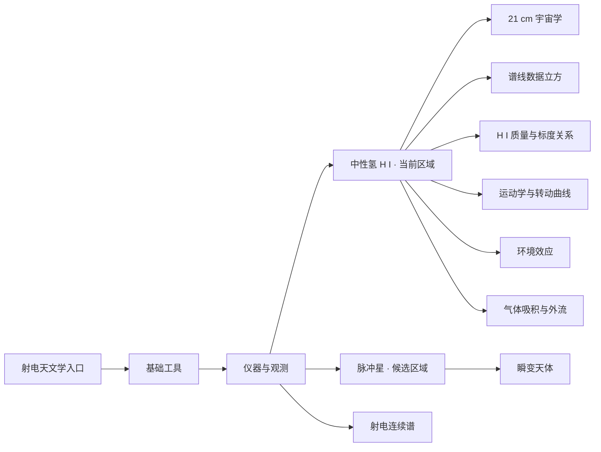
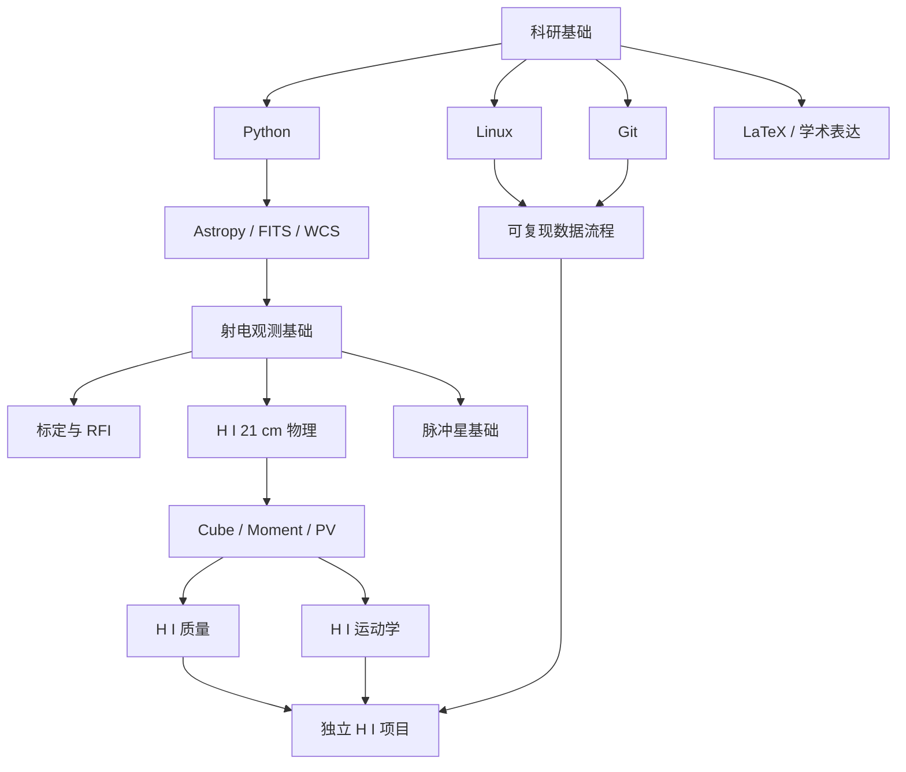
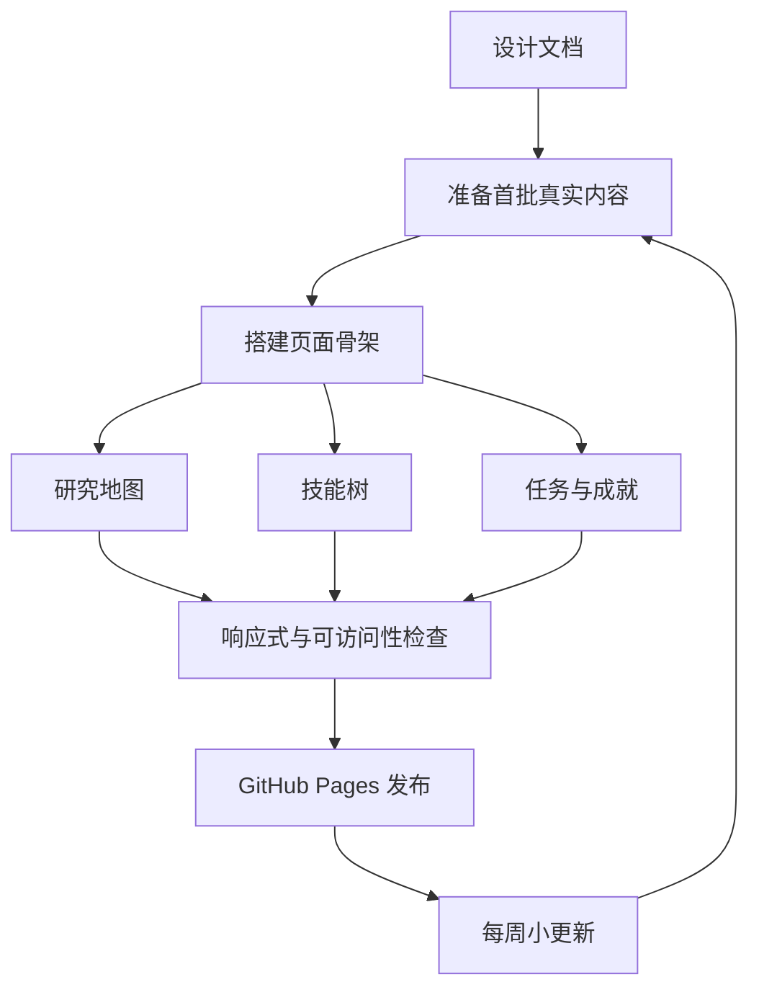

# 07 可编辑流程图

以下 Mermaid 图可以直接在支持 Mermaid 的 Markdown 编辑器中修改和预览，也可作为开发时的结构依据。

## 科研世界地图

```mermaid
flowchart LR
    HOME["射电天文学入口"]
    FUND["基础工具"]
    INST["仪器与观测"]
    HI["中性氢 H I · 当前区域"]
    PSR["脉冲星 · 候选区域"]
    TRANS["瞬变天体"]
    CONT["射电连续谱"]
    COSMO["21 cm 宇宙学"]

    HOME --> FUND
    FUND --> INST
    INST --> HI
    INST --> PSR
    PSR --> TRANS
    INST --> CONT
    HI --> COSMO

    HI --> CUBE["谱线数据立方"]
    HI --> MASS["H I 质量与标度关系"]
    HI --> KIN["运动学与转动曲线"]
    HI --> ENV["环境效应"]
    HI --> FLOW["气体吸积与外流"]
```

## 技能树

```mermaid
flowchart TD
    BASE["科研基础"] --> PY["Python"]
    BASE --> LINUX["Linux"]
    BASE --> GIT["Git"]
    BASE --> WRITE["LaTeX / 学术表达"]

    PY --> ASTRO["Astropy / FITS / WCS"]
    LINUX --> PIPE["可复现数据流程"]
    GIT --> PIPE

    ASTRO --> RADIO["射电观测基础"]
    RADIO --> CAL["标定与 RFI"]
    RADIO --> HI21["H I 21 cm 物理"]
    RADIO --> PULSAR["脉冲星基础"]

    HI21 --> CUBE["Cube / Moment / PV"]
    CUBE --> HIMASS["H I 质量"]
    CUBE --> KIN["H I 运动学"]
    HIMASS --> PROJECT["独立 H I 项目"]
    KIN --> PROJECT
    PIPE --> PROJECT
```

## 第一篇论文主线

```mermaid
flowchart LR
    A["射电与 H I 基础"] --> B["跑通公开数据案例"]
    B --> C["复现论文结果"]
    C --> D["识别可验证问题"]
    D --> E["确认数据与方法"]
    E --> F["完成主分析"]
    F --> G["系统误差与稳健性"]
    G --> H["形成科学叙事"]
    H --> I["写作与投稿"]
    I --> J["回复审稿"]
    J --> K["第一篇一作论文"]
```

## 网站实现流程

```mermaid
flowchart TD
    IDEA["设计文档"] --> CONTENT["准备首批真实内容"]
    CONTENT --> SHELL["搭建页面骨架"]
    SHELL --> MAP["研究地图"]
    SHELL --> SKILLS["技能树"]
    SHELL --> QUESTS["任务与成就"]
    MAP --> QA["响应式与可访问性检查"]
    SKILLS --> QA
    QUESTS --> QA
    QA --> PAGES["GitHub Pages 发布"]
    PAGES --> ITERATE["每周小更新"]
    ITERATE --> CONTENT
```

